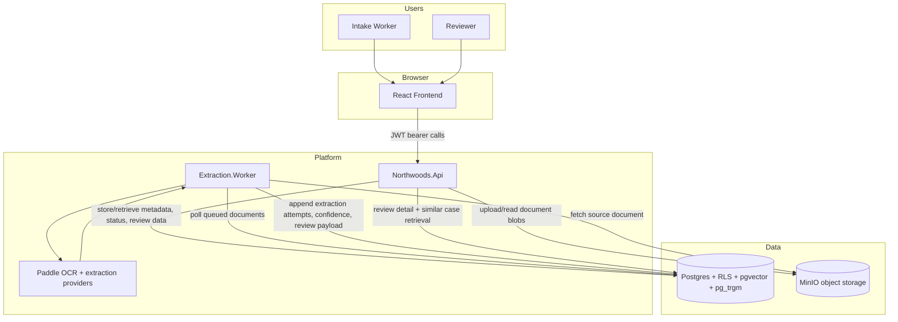

# Northwoods Architecture Rationale

## Why this document exists

This document explains **how Northwoods is designed today** and **why those decisions were made** so a reviewer who has never seen the codebase can evaluate capability boundaries, trust boundaries, and intentional trade-offs.

It summarizes the current system after ADRs 001-005 and issues #1/#3/#4/#5/#6.

## System architecture diagram

## Component responsibilities

| Component | Primary responsibility | Not responsible for |
|---|---|---|
| **Frontend (`apps/web`)** | Authenticated intake/review UI; status visibility; confidence-focused reviewer workflow | Business rules, tenancy enforcement, extraction logic |
| **API (`src/Services/Northwoods.Api`)** | Authn/authz, upload/review/finalize endpoints, audit events, tenant-scoped query surface, similar-case API response shaping | OCR/extraction execution, background scheduling engine |
| **Extraction Worker (`src/Workers/Extraction.Worker`)** | Background polling, staged extraction pipeline, confidence gating, append-only extraction attempt persistence | Public API, interactive UX, tenant policy authoring |
| **Postgres (`infra/postgres`)** | System of record for documents, extracted fields, attempts, review/final state, audit events, RAG profiles; RLS enforcement backstop | Blob storage, UI behavior |
| **MinIO** | Durable storage for uploaded PDFs/images and derived artifacts | Querying structured fields, access policy logic |

This split keeps trust boundaries clear: API owns request/identity boundaries, worker owns extraction behavior, database enforces tenant-safe persistence boundaries.

## Template and extraction model design

### Template model

- Intake upload is template-guided (issue #3).
- A template defines expected field structure and display behavior for review.
- Template selection happens at intake time and drives extraction/review semantics.

### Extraction model

- Extraction runs in the worker, not in request/response paths.
- Worker executes staged providers (OCR + normalization/extraction stages).
- Each run persists **attempt history** with run/stage metadata; attempts are append-only.
- Confidence is explicit and centralized into operational tiers (`High`, `ReviewRequired`, `Escalate`).
- Reviewer-facing payloads are generated from extracted candidates plus confidence so uncertain fields are prioritized.

Why this matters:

- Ambiguous fields are surfaced to humans instead of silently accepted.
- Every extraction run is auditable and replayable for debugging and quality tuning.
- Provider-specific behavior is contained in worker abstractions so stages can be swapped without API contract churn.

## RAG design and retrieval strategy

Northwoods uses retrieval to assist reviewer judgment during review (not as a standalone demo).

### Data shape

- Historical case profiles are tenant-scoped and stored in Postgres.
- Profiles include:
  - embedding vector (`pgvector`),
  - full-text search column,
  - structured attributes used for deterministic matching boosts.

### Retrieval approach

- Hybrid retrieval combines:
  - full-text search,
  - vector similarity,
  - trigram/fuzzy matching,
  - structured boosts (for high-signal fields, e.g., DOB agreement).
- Scores are fused with reciprocal-rank-style blending to reduce dependence on one retrieval mode.
- API returns top similar cases in review detail so reviewers can compare context while validating uncertain fields.

Why this design:

- Avoids single-modality brittleness.
- Keeps retrieval tenant-local and queryable in one datastore.
- Improves reviewer throughput by bringing relevant precedent into the decision point.

## Multi-tenancy strategy and implications

Northwoods uses **shared Postgres with tenant scoping and RLS backstop** (ADR-004), plus tenant-scoped object storage conventions.

### Enforcement model

- Tenant identity is derived from JWT claims at API boundary (issue #4).
- API and worker open DB sessions with tenant context (`app.tenant_id`), then execute tenant-scoped queries.
- RLS policies enforce tenant filtering even if an application query is incomplete.
- Retrieval/index tables used for similar cases are also tenant-scoped.

### Implications

Positive:

- Stronger defense-in-depth for tenant isolation.
- Single operational footprint for this stage of product maturity.
- Tenant-safe auditability across upload, extraction, review, finalize.

Costs/trade-offs:

- Query discipline is mandatory (RLS is a backstop, not a substitute for clear predicates).
- Cross-tenant analytics become explicit product work, not accidental byproducts.
- Operational tuning (indexes/vacuum/partitioning strategy) must be done with mixed-tenant load patterns in mind.

## Trade-offs and intentional omissions

1. **Worker polling over Temporal orchestration today**
   - Simpler deployment and lower cognitive overhead at current scale.
   - Omission: richer workflow replay/compensation semantics are limited until orchestration is upgraded.

2. **Postgres-centered retrieval stack**
   - Keeps consistency, tenancy controls, and retrieval logic in one place.
   - Omission: no separate vector infra with independent scaling characteristics.

3. **Human-in-the-loop as a hard invariant**
   - Low-confidence data is routed to review; no silent auto-accept path.
   - Trade-off: potentially slower throughput in ambiguous cases, accepted in exchange for trust/audit safety.

4. **Institutional UX over novelty**
   - Frontend prioritizes confidence/status legibility and accessibility over decorative interaction.
   - Omission: intentionally avoids advanced motion/visual experimentation that could obscure workflow clarity.

5. **AI usage is assistive, not authority**
   - AI accelerates development and extraction stages, but acceptance criteria remain deterministic, testable, and review-gated.
   - Tooling/process details are documented in [AI Development Tooling Used](ai-tooling.md).

## References

- [ADR 001: Use Postgres hybrid retrieval with `pgvector` and `pg_trgm`](ADRs/001-postgres-hybrid-retrieval-with-pgvector-and-pg-trgm.md)
- [ADR 002: Use Temporal for document processing workflows](ADRs/002-temporal-for-document-processing-workflows.md)
- [ADR 003: Use MinIO for S3-compatible document storage](ADRs/003-minio-for-s3-compatible-document-storage.md)
- [ADR 004: Use shared Postgres tenancy with `tenant_id` and RLS backstop](ADRs/004-shared-postgres-tenancy-with-rls-backstop.md)
- [ADR 005: Use a portable multi-stage consensus extraction pipeline](ADRs/005-portable-consensus-extraction-pipeline.md)
- [Reviewer Rubric](reviewer-rubric.md)
- [AI Development Tooling Used](ai-tooling.md)
