# TraverseLite (Northwoods) — Reviewer Walkthrough

## Quick Start

```bash
# Clone and start everything
git clone https://github.com/open-horizon-labs/northwoods.git
cd northwoods
cp .env.example .env          # Set OPENAI_API_KEY for extraction + embeddings
docker compose up -d           # Starts: API, Worker, Postgres, MinIO, Web
```

Services will be available at:
- **Web UI**: http://localhost:5173
- **API**: http://localhost:5100
- **API Docs (Scalar)**: http://localhost:5100/scalar/v1
- **OpenAPI JSON**: http://localhost:5100/openapi/v1.json
- **MinIO Console**: http://localhost:9001 (minioadmin / minioadmin)

**Live demo**: https://northwoods.muness.com

---

## Test Accounts

All accounts use password: **`password`**

| Email | Role | Tenant | What you can do |
|-------|------|--------|-----------------|
| worker@sunrise.example | Intake Worker | Sunrise (tenant-a) | Upload documents, view status, download blank forms |
| reviewer@sunrise.example | Reviewer | Sunrise (tenant-a) | Review queue, correct fields, finalize, see similar cases |
| admin@sunrise.example | Admin | Sunrise (tenant-a) | Manage templates, add/edit fields, upload blank PDFs |
| worker@lakewood.example | Intake Worker | Lakewood (tenant-b) | Same as above, isolated data |
| reviewer@lakewood.example | Reviewer | Lakewood (tenant-b) | Same as above, isolated data |
| admin@lakewood.example | Admin | Lakewood (tenant-b) | Same as above, isolated data |

Tenant isolation is enforced at every layer — Sunrise users cannot see Lakewood data and vice versa.

---

## Architecture Overview



### Component Summary

| Layer | Technology | Role |
|-------|-----------|------|
| **Frontend** | React 19, Vite, Tailwind CSS v4, PDF.js | SPA with role-based routing, auto-refresh polling, confidence-focused review UX |
| **API** | .NET 9, Minimal APIs, Dapper | Auth, upload, review/finalize, search, RAG retrieval, admin ops, Scalar API docs |
| **Worker** | .NET BackgroundService | Polls for uploaded docs, runs extraction pipeline, generates embeddings |
| **Database** | Postgres 18 + pgvector + pg_trgm | RLS on all tables, HNSW vector index, FTS, trigram indexes, append-only audit trail |
| **Object Storage** | MinIO (S3-compatible) | Document PDFs, blank template forms |
| **External** | OpenAI API | Vision extraction (gpt-5.4-nano/mini), embeddings (text-embedding-3-small) |

### Key Architecture Decisions (ADRs)

1. **ADR 001** — Postgres hybrid retrieval (pgvector + pg_trgm + FTS + RRF fusion) instead of separate vector DB
2. **ADR 002** — Temporal deferred; BackgroundService polling worker used instead
3. **ADR 003** — MinIO for S3-compatible document storage
4. **ADR 004** — Shared Postgres with row-level security (RLS) backstop for multi-tenancy
5. **ADR 005** — Portable multi-stage consensus extraction pipeline with provider abstraction

---

## Core Workflow Walkthrough

### 1. Upload (Intake Worker)
1. Log in as `worker@sunrise.example`
2. Select a template (e.g., "General Assistance Intake")
3. Upload a scanned PDF from `samples/intakes/`
4. Document appears with "Queued" → "Processing" status
5. Worker extracts fields via OpenAI Vision with per-field confidence

### 2. Review (Reviewer)
1. Log in as `reviewer@sunrise.example`
2. Queue shows documents needing review (status = `review_ready`)
3. Click a document to see:
   - **Left panel**: PDF viewer with the scanned form
   - **Right panel**: Extracted fields with confidence scores (color-coded)
   - **Similar Cases**: Hybrid RAG retrieval showing related historical cases
   - **Audit Trail**: Full event history
4. Correct any low-confidence fields
5. Click "Finalize" — triggers embedding regeneration with corrected values

### 3. Similar Cases (RAG)
During review, the system surfaces similar historical cases using 5 retrieval signals:
- **Full-text search** (tsvector/tsquery)
- **Vector similarity** (pgvector cosine with HNSW index)
- **Name fuzzy match** (pg_trgm trigram similarity)
- **Address fuzzy match** (pg_trgm)
- **DOB exact match** (structured boost)

Scores are fused with **Reciprocal Rank Fusion (RRF)** — `SUM(1.0 / (60.0 + rank))`. AI-generated contextual summaries explain why cases are similar.

### 4. Search & Case View
- **Search tab**: Full-text + trigram fuzzy search across all processed intakes
- **Case aggregation**: `GET /cases/{personKey}` groups all documents for a person

### 5. Admin
1. Log in as `admin@sunrise.example`
2. Manage templates: add/edit field schemas, upload blank PDF forms
3. Admin operations: reprocess documents, wipe tenant data

---

## Extraction Pipeline Detail

```
Document uploaded
    ↓
Worker polls (5s interval)
    ↓
OpenAI Vision (gpt-5.4-nano)
  → Extracts ALL fields found on form
  → Returns schema fields + discovered fields
  → Per-field confidence 0.0–1.0
    ↓
Quality gate:
  Low confidence / empty / unparseable?
    → Escalate to gpt-5.4-mini
    ↓
Field consensus + confidence gating:
  >= 0.90 → Auto-Accepted (completed)
  0.75–0.90 → Review Recommended (review_ready)
  < 0.75 → Review Required (review_ready + requires_attention)
    ↓
Case profile created + embedding generated
    ↓
Audit event: extraction_completed
```

---

## PDF Corpus Creation Process

The seed corpus was generated synthetically using Python scripts in `scripts/corpus/`:

1. **People definitions** (`people.py`): 40 fictional persons across two tenants with realistic demographics, addresses, and longitudinal narratives
2. **Form generators** (`gen_general.py`, `gen_housing.py`, `gen_behavioral.py`, `gen_soap.py`): Create filled PDF forms using ReportLab, simulating handwritten intake documents
3. **Narrative arcs** (`narrative.py`): Each person has a multi-visit story (e.g., housing instability → behavioral health → follow-up) to test the RAG similar-case retrieval
4. **Two cohorts**: v1 (new forms) and v2 (old forms) to test template version handling
5. **Cross-tenant transfers**: Some persons (P017/P018, P037/P038) appear in both tenants to test cross-agency scenarios

The runtime seed in `DatabaseInitializer.SeedCorpusAsync` loads a condensed 8-document corpus (P017, P019, P037, P039) with full extracted fields and case profiles for RAG demo purposes. Embeddings are generated on first API startup when `OPENAI_API_KEY` is set.

---

## Seed Data & Database Initialization

On `docker compose up`, the system:

1. **Schema creation** (`DatabaseInitializer.cs`): Creates all tables, enables pgvector/pg_trgm extensions, applies RLS policies, creates indexes (including HNSW for vector search)
2. **User seeding**: 6 users (3 per tenant) with bcrypt-hashed passwords
3. **Template seeding**: 4 templates per tenant with field schemas
4. **Corpus seeding**: 8 documents with extracted fields and case profiles
5. **Blank PDF seeding**: Uploads sample PDFs from `samples/intakes/` to MinIO as blank template forms
6. **RLS assertion**: Verifies row-level security is working by testing cross-tenant query isolation at startup

---

## Observability

- **Structured JSON logging** with correlation IDs (`X-Correlation-Id` header propagation)
- **Health check**: `GET /health` — verifies Postgres connectivity
- **Metrics**: `GET /metrics` — request count, extraction success/failure, review finalizations
- **Audit events**: `intake_uploaded`, `extraction_started`, `extraction_completed`, `extraction_failed`, `field_corrected`, `finalized`, `embedding_regenerated`
- **CI**: Build, .NET tests (32/32), Playwright smoke tests, ADR compliance checks, secret scan

---

## Tests

| Category | Count | Location |
|----------|-------|----------|
| Worker unit tests | ~17 | `tests/Northwoods.Worker.UnitTests/` |
| Tenancy unit tests | 4 | `tests/Northwoods.Tenancy.UnitTests/` |
| API integration tests | ~12 | `tests/Northwoods.Api.IntegrationTests/` |
| Playwright e2e smoke tests | 8 | `apps/web/e2e/smoke.spec.ts` |
| RAG pipeline smoke tests | 2 | `tests/Northwoods.Api.IntegrationTests/RagPipelineSmokeTests.cs` |

Run tests:
```bash
dotnet test                              # All .NET tests
pnpm --filter web test:e2e               # Playwright smoke tests (needs running dev server)
```

---

## Appendix: AI Tooling Used

This project was developed with an AI-assisted workflow. The AI tooling used is authored by the candidate and represents a broader approach to structured, reflective development.

### Repo-Native Alignment (RNA)
An MCP server that makes repository context queryable through semantic search and graph-style code/document relationships. Used to keep code, docs, outcomes, and decisions connected — enabling agents to find relevant context without manual grep or memory. RNA surfaces business outcomes alongside code, so development work stays aligned with what matters.

### Open Horizons Skills
A suite of workflow skills used to structure thinking and execution. Key skills used in this exercise:

- **`/aim`** — Define the outcome before starting work
- **`/problem-statement`** — Frame what you're actually solving (not the first solution that comes to mind)
- **`/solution-space`** — Explore candidate approaches before committing; includes the escalation ladder (band-aid → local optimum → reframe → redesign)
- **`/oh-plan`** — Decompose selected solutions into right-sized GitHub issues
- **`/execute`** — Implementation with continuous alignment checks
- **`/dissent`** — Challenge decisions before they become load-bearing

These skills act as lightweight operating procedures for high-judgment work — they encode the meta-cognitive patterns that experienced engineers use intuitively, making them available to AI agents and reproducible across sessions.

### Oh My Pi / Open Horizons MCP
The strategic alignment layer. Connects work to personal aims and decision criteria through a context graph. Used to keep the submission aligned with the kind of technical leadership the candidate wants to demonstrate — not just "does it compile" but "does the architecture reflect genuine judgment."

### Dev-Pipeline Agents
Custom Claude Code agents (`.claude/agents/`) that automate the full issue lifecycle:
- **`dev-pipeline`**: Problem statement → solution space → execute → ship (PR creation + merge)
- **`dev-pipeline-oversight`**: Wraps dev-pipeline with post-merge comment audit — verifies ALL PR review comments (CodeRabbit, human, review skill) are addressed, not just the agent's own findings

### CodeRabbit
Automated PR review service providing severity-classified findings on every PR. Integrated into the dev-pipeline ship step so no PR merges with unresolved Critical or Major findings.

### How AI Was Used in This Exercise
AI was used to **accelerate**, not to **replace judgment**. Architecture decisions, trade-off evaluations, and design choices were made by the candidate. AI assisted with:
- Code generation and refactoring
- Automated testing and review
- Documentation accuracy verification
- Parallel research (adversarial review, friction testing, code quality audit)
- Systematic issue creation and resolution

The overnight sprint (documented in `docs/sprint-2026-03-28-overnight.md`) demonstrates the approach: parallel research agents identified 50+ issues across code quality, docs accuracy, UX friction, and requirements compliance. These were triaged, prioritized, and resolved through 11 sequential dev-pipeline-oversight agents — each creating a PR, addressing CodeRabbit findings, and merging.
